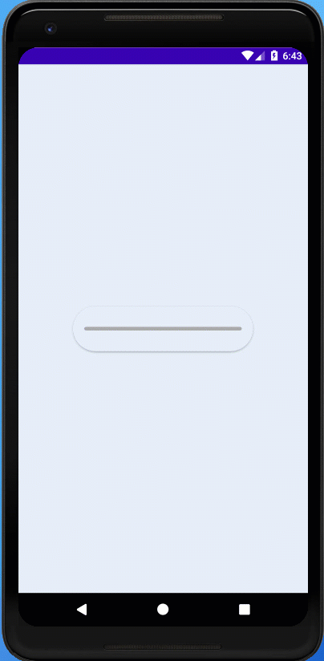

# MoonyProgressBar

[](https://jitpack.io/#doctor-blue/MoonyProgressBar)
[](https://android-arsenal.com/api?level=16)

## GIF


## Setup

```gradle
allprojects {
  repositories {
    ...
    maven { url 'https://jitpack.io' }
  }
}

dependencies {
	 implementation 'com.github.doctor-blue:MoonyProgressBar:1.0.0'
}
```

### This view base on CardView
## Customization
- In your layout.xml
```xml
    <com.devcomentry.progressbarlibrary.MoonyProgressBar
        android:id="@+id/progress_bar"
        style="@style/Widget.MoonyLib.ProgressBar.CustomStyleName"
        android:layout_width="256dp"
        android:layout_height="64dp"
        android:clickable="true"
        android:focusable="true"
        app:cardBackgroundColor="#e5edf7"
        app:cardElevation="2dp"
        app:layout_constraintBottom_toBottomOf="parent"
        app:layout_constraintLeft_toLeftOf="parent"
        app:layout_constraintRight_toRightOf="parent"
        app:layout_constraintTop_toTopOf="parent" />

```
- Custom theme (color, message, etc.)
```xml
    <style name="Widget.MoonyLib.ProgressBar.CustomStyleName" parent="Widget.MoonyLib.ProgressBar">
        <item name="progressColor">@color/purple_500</item>
        <item name="failedColor">@color/failedColor</item>
        <item name="completedColor">@color/completedColor</item>
        <item name="defaultColor">@android:color/darker_gray</item>
        <item name="inProgressMess">Downloading...</item>
        <item name="failedMess">Failed!</item>
        <item name="pausedMess">Paused!</item>
        <item name="completedMess">Completed!</item>
        <item name="textSize">14sp</item>
    </style>
```
## Update progress
```kotlin
    progressBar.setState(ProgressState.IN_PROGRESS, i.toFloat())
```
- State
```kotlin
enum class ProgressState {
    IN_PROGRESS,
    COMPLETED,
    FAILED,
    PAUSED,
    PREPARE,
}
```


## Donate
<a href="https://www.buymeacoffee.com/doctorblue" target="_blank"></a>
[](https://www.paypal.me/doctorblue00)
